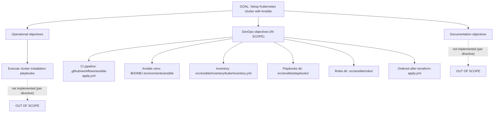
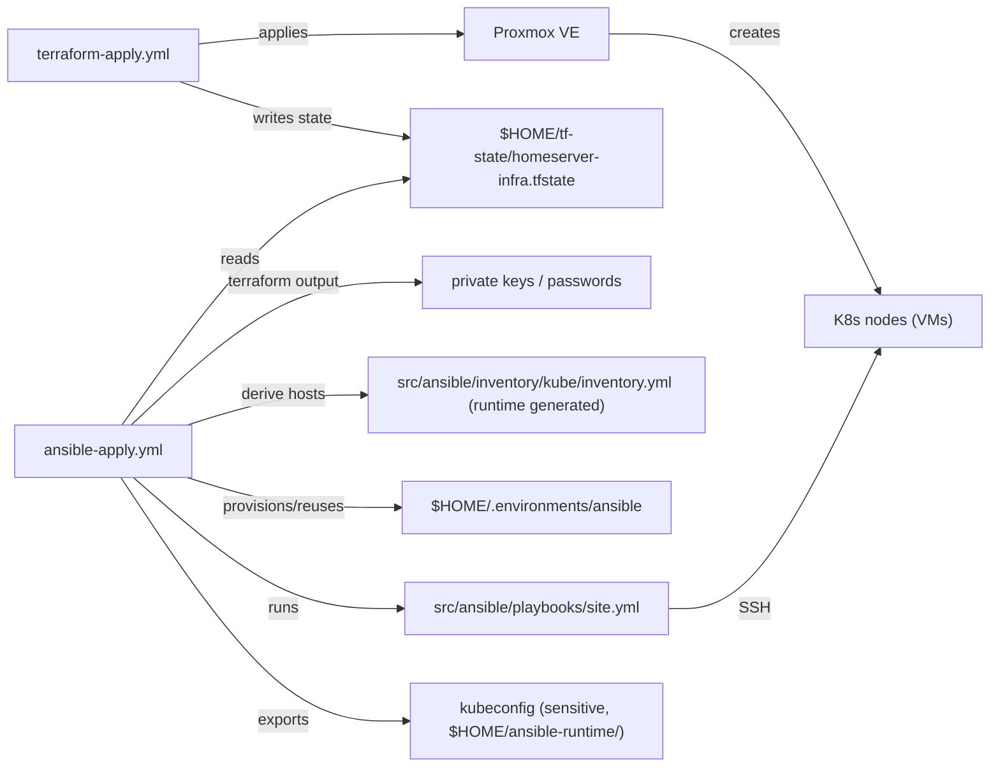
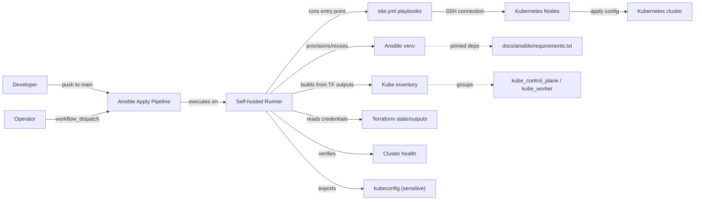
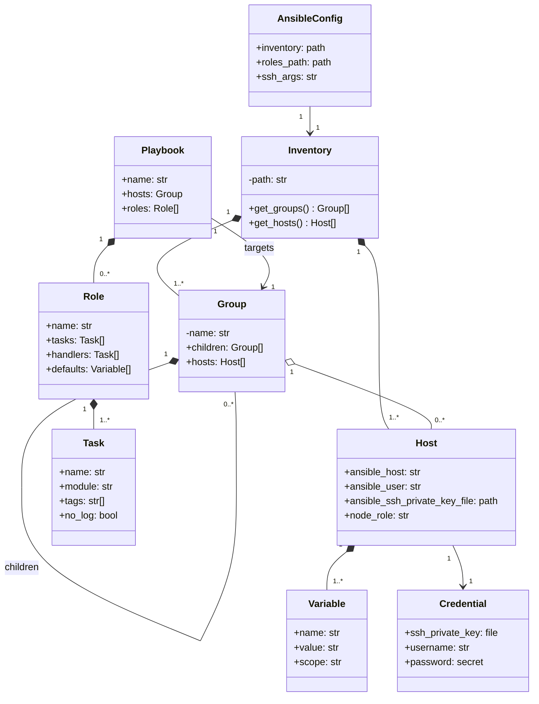
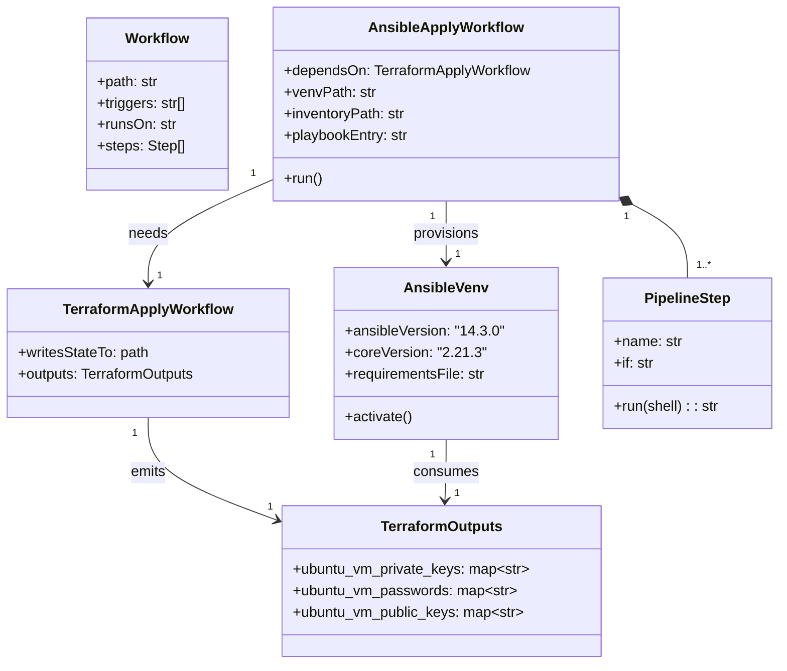
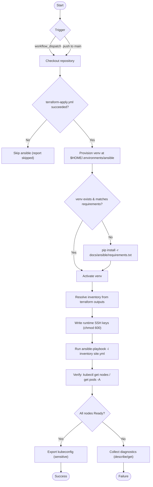
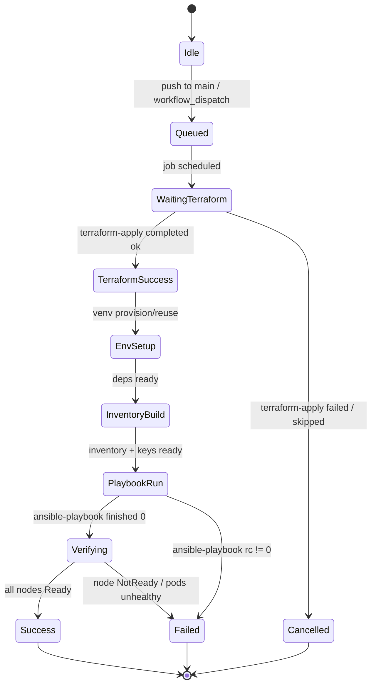
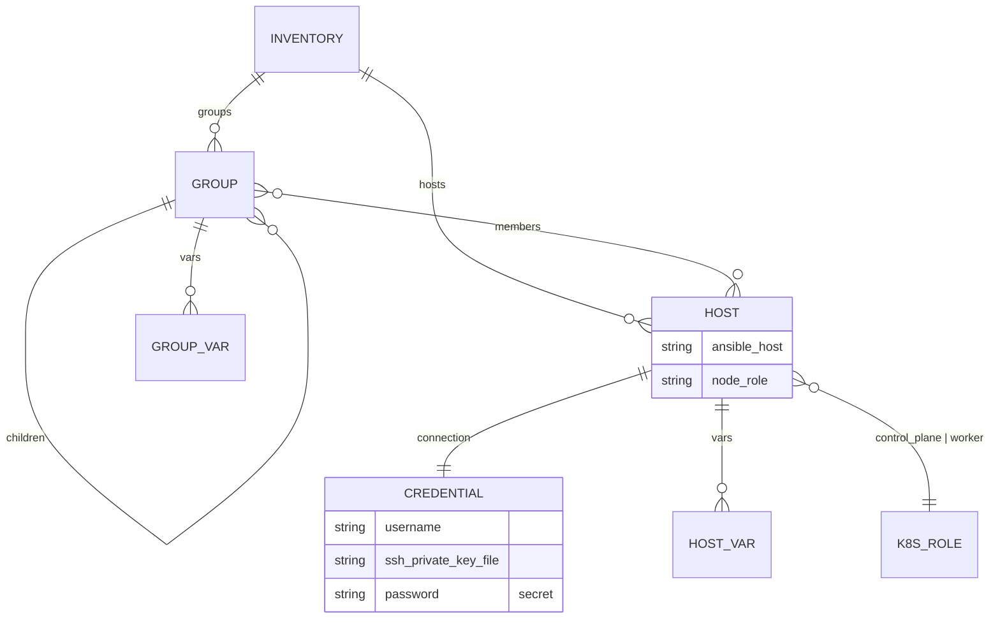
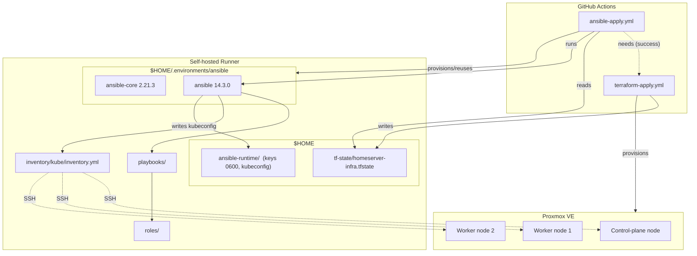

# Kubernetes Cluster Setup — CI Requirements Documentation

| Field | Value |
| --- | --- |
| Document ID | `HS-ANS-001` |
| Version | 1.0 |
| Status | Draft |
| Date | 2026-08-12 |
| Source | `docs/ansible/00_kube_setup.md` |
| Scope | DevOps (CI) objectives of the Ansible Kubernetes setup |

---

## Table of Contents

1. [Introduction](#1-introduction)
2. [Objective Analysis](#2-objective-analysis)
3. [Stakeholders](#3-stakeholders)
4. [Definitions and Abbreviations](#4-definitions-and-abbreviations)
5. [Constraints and Assumptions](#5-constraints-and-assumptions)
6. [Functional Requirements](#6-functional-requirements)
7. [Non-Functional Requirements](#7-non-functional-requirements)
8. [Interfaces and Data Flow](#8-interfaces-and-data-flow)
9. [Design Overview](#9-design-overview)
10. [UML Models](#10-uml-models)
11. [Traceability Matrix](#11-traceability-matrix)
12. [Acceptance Criteria](#12-acceptance-criteria)
13. [Out of Scope](#13-out-of-scope)
14. [Open Questions](#14-open-questions)

---

## 1. Introduction

### 1.1 Purpose

This document captures the **requirements for the Continuous Integration (DevOps)
workstream** of the Ansible-based Kubernetes cluster setup. It is derived from the
objectives defined in `docs/ansible/00_kube_setup.md` and provides the traceable,
testable specification needed to implement and verify the CI pipeline that applies
Ansible playbooks against a Kubernetes cluster provisioned by Terraform.

### 1.2 Scope

In scope:

- The GitHub Actions CI pipeline `.github/workflows/ansible-apply.yml`.
- The Ansible execution environment (`$HOME/.environments/ansible`).
- The inventory location `src/ansible/inventory/kube/inventory.yml`.
- The playbook and role directory layout (`src/ansible/playbooks/`, `src/ansible/roles/`).
- The interface between the Terraform apply workflow and the Ansible apply workflow.

Out of scope — explicitly excluded by the source document:

- **Operational objectives** — the actual cluster installation playbooks/roles.
- **Documentation objectives** — documentation deliverables for the Ansible part.

---

## 2. Objective Analysis

### 2.1 Source Objective

> Objective of this part of ansible playbooks should be setup of kubernetes cluster.

The overarching goal is: **provision and operate a Kubernetes cluster using Ansible**.
To make this tractable, the objective is decomposed into three categories.

### 2.2 Objective Decomposition

| # | Category | Description | Directive | In scope for this document? |
| --- | --- | --- | --- | --- |
| 1 | **Operational** | Actual K8s cluster setup: node bootstrap, control plane, workers | `DO NOT DO ANYTHING REGARDING OPERATIONAL OBJECTIVES` | ❌ No |
| 2 | **DevOps** | Bring in all environments to support continuous integration. CI handled by GitHub Actions | Implement pipeline + environment | ✅ **Yes** |
| 3 | **Documentation** | Documentation objectives for the Ansible setup | `DO NOT DO ANYTHING REGARDING DOCUMENTATION OBJECTIVES` | ❌ No |

### 2.3 DevOps Objective (In Scope)

> This should bring in all the necessary environments to implementation with
> continuous integration. The primary CI operations are handled by `github actions`.

Interpretation: The deliverables must enable an Ansible environment that is
**provisioned and driven automatically by GitHub Actions**, so that cluster
configuration can be applied repeatedly and reproducibly.

### 2.4 Goal Tree



---

## 3. Stakeholders

| Stakeholder | Interest |
| --- | --- |
| **Operator / Home-lab owner** | Repeatable, one-command cluster provisioning; safe credentials handling. |
| **Developer** | CI pipeline that runs on push and on demand; fast feedback on playbook changes. |
| **GitHub Actions (self-hosted runner)** | Executes both Terraform and Ansible workflows; shared local state and secrets. |
| **Terraform workflow** | Produces the VMs (nodes) and the connection credentials consumed by Ansible. |
| **Kubernetes nodes (Proxmox VMs)** | Targets of the Ansible playbooks; must be reachable over SSH. |

---

## 4. Definitions and Abbreviations

| Term | Definition |
| --- | --- |
| CI | Continuous Integration |
| K8s | Kubernetes |
| Control plane | The node(s) hosting `kube-apiserver`, `etcd`, controller-manager, scheduler |
| Worker | A node running workloads (pods) |
| kubeadm | Tool used to bootstrap a Kubernetes cluster |
| kubeconfig | File containing cluster connection credentials |
| Self-hosted runner | GitHub Actions runner running on the home-lab machine |
| Venv | Python virtual environment |

---

## 5. Constraints and Assumptions

### 5.1 Constraints

| ID | Constraint |
| --- | --- |
| C-01 | **Operational objectives must not be implemented** (per `00_kube_setup.md`). |
| C-02 | **Documentation objectives must not be implemented** (per `00_kube_setup.md`). |
| C-03 | CI orchestration is exclusively the responsibility of GitHub Actions. |
| C-04 | The pipeline runs on a **self-hosted runner** (shared with the Terraform workflow). |
| C-05 | Terraform state is **local to the runner** at `$HOME/tf-state/homeserver-infra.tfstate` — it is the source of truth for node identity. |
| C-06 | Node VMs are created by the `modules/kube` Terraform module from cloud-init Ubuntu templates. |
| C-07 | Ansible version is pinned via `docs/ansible/requirements.txt` (`ansible==14.3.0`, `ansible-core==2.21.3`). |

### 5.2 Assumptions

| ID | Assumption |
| --- | --- |
| A-01 | Nodes run Ubuntu cloud images with the QEMU guest agent installed (configured by the Terraform module). |
| A-02 | The runner can reach each node over SSH (port 22) using the credentials generated by Terraform. |
| A-03 | Static IPs for nodes are known from the `kube_vms` Terraform variable and/or Terraform outputs. |
| A-04 | The runner has outbound internet access for installing packages (containerd, kubeadm, etc.) during operational work. |
| A-05 | The cluster distribution is kubeadm-based (control plane + workers) as reflected by the Terraform VM layout. |
| A-06 | GitHub secrets (`PROXMOX_*`) used by the Terraform workflow are also available to the Ansible workflow where needed. |

---

## 6. Functional Requirements

Requirements use MoSCoW priorities: **M**ust, **S**hould, **C**ould, **W**on't.

### 6.1 CI Pipeline (`.github/workflows/ansible-apply.yml`)

| ID | Requirement | Priority |
| --- | --- | --- |
| FR-CI-001 | The workflow file must be located at `.github/workflows/ansible-apply.yml`. | M |
| FR-CI-002 | The pipeline must run on the **self-hosted** runner (shared with `terraform-apply.yml`) so that Terraform state and credentials are available. | M |
| FR-CI-003 | The pipeline must be triggerable **manually** via `workflow_dispatch`. | M |
| FR-CI-004 | The pipeline must run **automatically** on `push` to the `main` branch. | M |
| FR-CI-005 | The pipeline must execute **only after** `.github/workflows/terraform-apply.yml` has completed successfully (e.g. `needs`, `workflow_run`, or a chained workflow). | M |
| FR-CI-006 | If the Terraform apply fails, the Ansible pipeline must **not** execute and must report the skip status. | M |
| FR-CI-007 | The pipeline must check out the repository at the triggering commit before running. | M |
| FR-CI-008 | The pipeline must emit a clear success/failure summary and link to the executed job logs. | S |

### 6.2 Ansible Environment (venv)

| ID | Requirement | Priority |
| --- | --- | --- |
| FR-VENV-001 | A dedicated Python virtual environment must exist at `$HOME/.environments/ansible`. | M |
| FR-VENV-002 | Environment setup must be **idempotent**: reuse the venv when present; recreate only when the requirements change. | M |
| FR-VENV-003 | The venv must be provisioned from the pinned `docs/ansible/requirements.txt`. | M |
| FR-VENV-004 | All Ansible commands (`ansible`, `ansible-playbook`, `ansible-galaxy`) must run with the venv's binaries. | M |
| FR-VENV-005 | The venv must survive runner reboots so that consecutive runs are fast. | S |

### 6.3 Inventory (`src/ansible/inventory/kube/inventory.yml`)

| ID | Requirement | Priority |
| --- | --- | --- |
| FR-INV-001 | A Kubernetes inventory file must exist at `src/ansible/inventory/kube/inventory.yml`. | M |
| FR-INV-002 | The inventory must define groups for `kube_control_plane` and `kube_worker`, plus an aggregate `kube_all` group. | M |
| FR-INV-003 | Node connection data (IP, username, SSH private key path) must be **derived from Terraform** so inventory stays consistent with provisioned VMs. | M |
| FR-INV-004 | The inventory must not contain raw secret material; it must reference secret-bearing files/variables. | M |
| FR-INV-005 | The inventory must be validated (`ansible-inventory --list`) before playbook execution. | S |

### 6.4 Secrets and Credentials

| ID | Requirement | Priority |
| --- | --- | --- |
| FR-SEC-001 | SSH private keys must be sourced from Terraform outputs (`ubuntu_vm_private_keys`) at runtime — never committed to the repository. | M |
| FR-SEC-002 | Node passwords (`ubuntu_vm_passwords`) must be consumed at runtime and never written to logs or inventory. | M |
| FR-SEC-003 | Materialised key files must be written with restrictive permissions (`600`) in a runtime directory (e.g. `$HOME/ansible-runtime/`). | M |
| FR-SEC-004 | Sensitive Ansible tasks/vars must use `no_log: true` where appropriate. | M |
| FR-SEC-005 | Secrets must be cleaned up or excluded from any persisted/uploaded artifacts. | S |

### 6.5 Playbook and Role Layout

| ID | Requirement | Priority |
| --- | --- | --- |
| FR-LAY-001 | Playbooks must live under `src/ansible/playbooks/`. | M |
| FR-LAY-002 | Roles must live under `src/ansible/roles/`. | M |
| FR-LAY-003 | An `ansible.cfg` must pin `inventory`, `roles_path`, `retry_files_enabled`, and SSH/control settings. | M |
| FR-LAY-004 | A single entry-point playbook (`site.yml`) must orchestrate the sub-playbooks, providing the stable interface the pipeline invokes. | M |
| FR-LAY-005 | Playbook ordering must be explicit and reviewable (numeric prefix or `import_playbook` order). | S |
| FR-LAY-006 | The operational content of these playbooks is **out of scope**; only the layout and invocation contract are required here. | M |

### 6.6 Execution and Verification

| ID | Requirement | Priority |
| --- | --- | --- |
| FR-X-001 | The pipeline must execute the playbook entry point (`site.yml`) against the kube inventory. | M |
| FR-X-002 | Executed playbooks must be **idempotent** and safe to re-run on an already-configured cluster. | M |
| FR-X-003 | After execution the pipeline must verify the cluster: all nodes report `Ready` and `kube-system` pods are healthy. | M |
| FR-X-004 | On verification failure the pipeline must fail with collected diagnostics (playbook output, `kubectl get nodes`, `kubectl get pods -A`). | M |
| FR-X-005 | The kubeconfig must be exported to a well-known runtime path (sensitive) for operator use. | S |
| FR-X-006 | Transient SSH failures must be retried with bounded retries/backoff. | S |

---

## 7. Non-Functional Requirements

| ID | Category | Requirement |
| --- | --- | --- |
| NFR-REL-001 | Reliability | The pipeline must be re-runnable after a partial failure without corrupting the cluster (idempotent recovery). |
| NFR-REL-002 | Reliability | Environment setup must recover from runner reboots (venv and state persist on disk). |
| NFR-SEC-001 | Security | No plaintext secrets in the repository, workflow logs, or artifacts. |
| NFR-SEC-002 | Security | Least-privilege SSH user (cloud-init `ubuntu` user) used for connection, not root. |
| NFR-MAINT-001 | Maintainability | Roles and playbooks follow a modular layout; each role owns its tasks, handlers, and defaults. |
| NFR-PORT-001 | Portability | All Ansible dependency versions are pinned in `docs/ansible/requirements.txt`. |
| NFR-PERF-001 | Performance | Venv reuse must keep pipeline bootstrap time negligible (no re-install on every run). |
| NFR-OBS-001 | Observability | Pipeline logs must distinguish environment setup, inventory build, playbook run, and verification phases. |

---

## 8. Interfaces and Data Flow

### 8.1 External Interfaces

| Interface | Producer | Consumer | Description |
| --- | --- | --- | --- |
| `terraform-apply.yml` | GitHub Actions | `ansible-apply.yml` | Completion signal + shared runner state. |
| Terraform state | `terraform-apply.yml` | Ansible pipeline | `$HOME/tf-state/homeserver-infra.tfstate` — single source of truth for VMs. |
| Terraform outputs | `outputs.tf` | Ansible pipeline | `ubuntu_vm_private_keys`, `ubuntu_vm_passwords`, `ubuntu_vm_public_keys` (all sensitive). |
| Node connectivity | Proxmox VMs | Ansible | SSH reachability from the runner. |
| Venv | `$HOME/.environments/ansible` | Ansible CLI | Executable `ansible-playbook` etc. |

### 8.2 Recommended Runtime Data Flow



**Ordering guarantee:** `ansible-apply.yml` is only triggered by a **successful**
`terraform-apply.yml` run (FR-CI-005/006). This preserves the invariant that Ansible
never runs against an unknown/drifted node set.

---

## 9. Design Overview

### 9.1 Directory Layout

```
src/ansible/
├── ansible.cfg                          # pinned inventory, roles_path, SSH settings
├── inventory/
│   └── kube/
│       └── inventory.yml                # groups: kube_control_plane, kube_worker
├── playbooks/
│   ├── site.yml                         # entry point invoked by the pipeline
│   └── ...                              # operational playbooks (OUT OF SCOPE)
└── roles/
    └── ...                              # operational roles (OUT OF SCOPE)

.github/workflows/
├── terraform-apply.yml                  # existing
└── ansible-apply.yml                    # THIS WORKFLOW (to be implemented)

docs/ansible/
├── 00_kube_setup.md                     # objectives source
├── 01_kube_setup_ci_requirements_documentation.md   # this document
└── requirements.txt                     # pinned Ansible dependency set
```

### 9.2 Runtime Environment (self-hosted runner)

| Path | Purpose |
| --- | --- |
| `$HOME/.environments/ansible` | Ansible Python venv (persistent). |
| `$HOME/tf-state/homeserver-infra.tfstate` | Terraform state written by `terraform-apply.yml`. |
| `$HOME/ansible-runtime/` | Generated inventory, SSH keys (`600`), kubeconfig. |

---

## 10. UML Models

### 10.1 Use Case Diagram

Actors: Developer, Operator, GitHub Actions runner, Kubernetes nodes.



### 10.2 Class Diagram — Ansible Domain Model



### 10.3 Class Diagram — CI Pipeline Components



### 10.4 Sequence Diagram — End-to-End CI Orchestration

```mermaid
sequenceDiagram
    actor Dev as Developer
    participant GH as GitHub Actions
    participant TF as terraform-apply.yml
    participant RS as Self-hosted Runner
    participant V as Ansible venv
    participant N as K8s Nodes (Proxmox VMs)

    Dev->>GH: push to main (or manual dispatch)
    GH->>TF: start Terraform Apply
    TF->>RS: init / plan / apply
    RS->>N: create & configure VMs (cloud-init)
    N-->>RS: VMs reachable over SSH
    RS-->>RS: persist tf-state + outputs at $HOME/tf-state

    alt terraform apply success
        GH->>RS: start Ansible Apply (chained)
        RS->>RS: checkout repo
        RS->>V: reuse or create $HOME/.environments/ansible
        V-->>RS: pip install -r docs/ansible/requirements.txt (if needed)
        RS->>RS: derive inventory from terraform outputs (IP, user, key path)
        RS->>RS: write runtime keys (0600) + generated inventory
        RS->>N: ansible-playbook site.yml (prereqs, control plane, workers)
        N-->>RS: task results
        RS->>N: verify kubectl get nodes / get pods -A
        alt all nodes Ready
            N-->>RS: cluster healthy
            RS-->>Dev: success + kubeconfig at $HOME/ansible-runtime/
        else node(s) NotReady
            N-->>RS: unhealthy
            RS-->>Dev: failure + collected diagnostics
        end
    else terraform apply failed
        GH-->>Dev: terraform failed; ansible skipped
    end
```

### 10.5 Activity Diagram — Ansible Apply Pipeline



### 10.6 State Diagram — Pipeline Lifecycle



### 10.7 Entity-Relationship Diagram — Inventory Data Model



### 10.8 Component / Deployment Diagram



### 10.9 Requirement Traceability Diagram

```mermaid
requirementDiagram
    requirement KUBE_GOAL {
        id: G1
        text: Setup a Kubernetes cluster using Ansible
        risk: medium
        verifymethod: inspection
    }
    requirement DEVOPS_OBJ {
        id: G2
        text: Bring all environments for continuous integration; CI via GitHub Actions
        risk: high
        verifymethod: test
    }
    requirement FR_CI_PIPELINE {
        id: FR-CI
        text: Ansible apply pipeline in .github/workflows/ansible-apply.yml ordered after terraform-apply
        risk: high
        verifymethod: test
    }
    requirement FR_VENV {
        id: FR-VENV
        text: Persistent Ansible venv at $HOME/.environments/ansible pinned via requirements.txt
        risk: medium
        verifymethod: inspection
    }
    requirement FR_INVENTORY {
        id: FR-INV
        text: Kube inventory with control-plane and worker groups derived from Terraform
        risk: medium
        verifymethod: inspection
    }
    requirement FR_SECRETS {
        id: FR-SEC
        text: Credentials sourced from Terraform outputs, never committed, chmod 600
        risk: high
        verifymethod: analysis
    }
    requirement FR_LAYOUT {
        id: FR-LAY
        text: Playbooks and roles under src/ansible/playbooks and src/ansible/roles with site.yml entry
        risk: low
        verifymethod: inspection
    }
    requirement FR_VERIFY {
        id: FR-X
        text: Verify cluster health post-apply; fail with diagnostics otherwise
        risk: medium
        verifymethod: test
    }

    element ansible_apply_workflow {
        type: workflow
        docref: .github/workflows/ansible-apply.yml
    }
    element ansible_venv {
        type: environment
        docref: docs/ansible/requirements.txt
    }
    element inventory_file {
        type: configuration
        docref: src/ansible/inventory/kube/inventory.yml
    }
    element terraform_workflow {
        type: workflow
        docref: .github/workflows/terraform-apply.yml
    }
    element playbook_tree {
        type: source-code
        docref: src/ansible
    }

    KUBE_GOAL - contains -> DEVOPS_OBJ
    DEVOPS_OBJ - derives -> FR_CI_PIPELINE
    DEVOPS_OBJ - derives -> FR_VENV
    FR_CI_PIPELINE - satisfies -> ansible_apply_workflow
    FR_VENV - satisfies -> ansible_venv
    FR_INVENTORY - satisfies -> inventory_file
    FR_SECRETS - verifies -> ansible_apply_workflow
    FR_LAYOUT - satisfies -> playbook_tree
    FR_VERIFY - verifies -> ansible_apply_workflow
    FR_CI_PIPELINE - traces -> terraform_workflow
```

---

## 11. Traceability Matrix

| Requirement | Source objective | Verification |
| --- | --- | --- |
| FR-CI-001 … FR-CI-008 | DevOps objective (CI via GitHub Actions) | Workflow inspection + job run |
| FR-VENV-001 … FR-VENV-005 | DevOps objective (environments for CI) | `ls $HOME/.environments/ansible`, `ansible --version` |
| FR-INV-001 … FR-INV-005 | DevOps objective (inventory path) | `ansible-inventory --list` |
| FR-SEC-001 … FR-SEC-005 | DevOps objective (environment readiness) | Secret scan, file permission audit |
| FR-LAY-001 … FR-LAY-006 | DevOps objective (paths) | Directory inspection |
| FR-X-001 … FR-X-006 | Overall goal (k8s setup) + verification | Playbook run + `kubectl get nodes` |
| NFR-* | Cross-cutting quality | CI run observations |

---

## 12. Acceptance Criteria

| # | Criterion |
| --- | --- |
| AC-01 | `.github/workflows/ansible-apply.yml` exists and runs on the self-hosted runner. |
| AC-02 | The Ansible pipeline does not run when `terraform-apply.yml` fails. |
| AC-03 | Running the pipeline twice in a row succeeds (idempotent environment + playbooks). |
| AC-04 | The venv at `$HOME/.environments/ansible` reports `ansible 14.3.0` and `ansible-core 2.21.3`. |
| AC-05 | `src/ansible/inventory/kube/inventory.yml` contains `kube_control_plane` and `kube_worker` groups with hosts matching Terraform-provisioned VMs. |
| AC-06 | No private key or node password is present in the repository or workflow logs. |
| AC-07 | On a green run, cluster verification reports all nodes `Ready`. |
| AC-08 | On failure, the pipeline fails with collected diagnostics and a clear summary. |

---

## 13. Out of Scope

Per the explicit directives in `docs/ansible/00_kube_setup.md`:

- **Operational objectives** — implementation of cluster installation playbooks/roles (node bootstrap, kubeadm init, worker joins, container runtime).
- **Documentation objectives** — documentation deliverables for the Ansible setup.

The CI pipeline must nonetheless be **ready** to execute the operational playbook tree
(`src/ansible/playbooks/site.yml`) once operational work is unblocked; that is the
integration contract this document guarantees.

---

## 14. Open Questions

| # | Question | Impact |
| --- | --- | --- |
| OQ-01 | How should Terraform outputs be handed to the Ansible workflow — `terraform output` on shared state, or a generated inventory/keys artifact? | Data-flow design (FR-INV-003) |
| OQ-02 | Should the chaining be `workflow_run`, `needs` on a reusable workflow, or an explicit dispatch from `terraform-apply.yml`? | FR-CI-005 implementation |
| OQ-03 | Which node is designated the control plane vs workers (Terraform `kube_vms` map key/name, tags, or IP)? | Inventory group mapping |
| OQ-04 | Is `kubeconfig` persisted between runs on the runner, or regenerated each run? | FR-X-005 |
