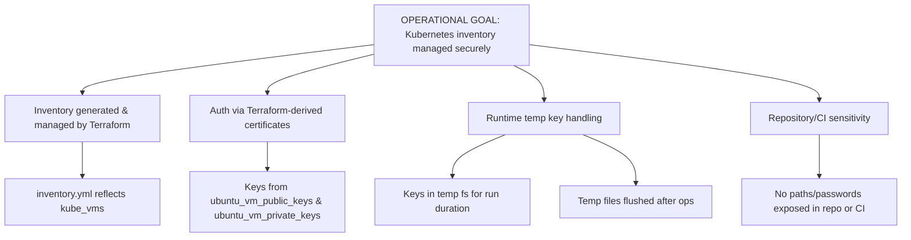
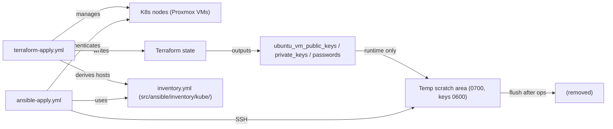
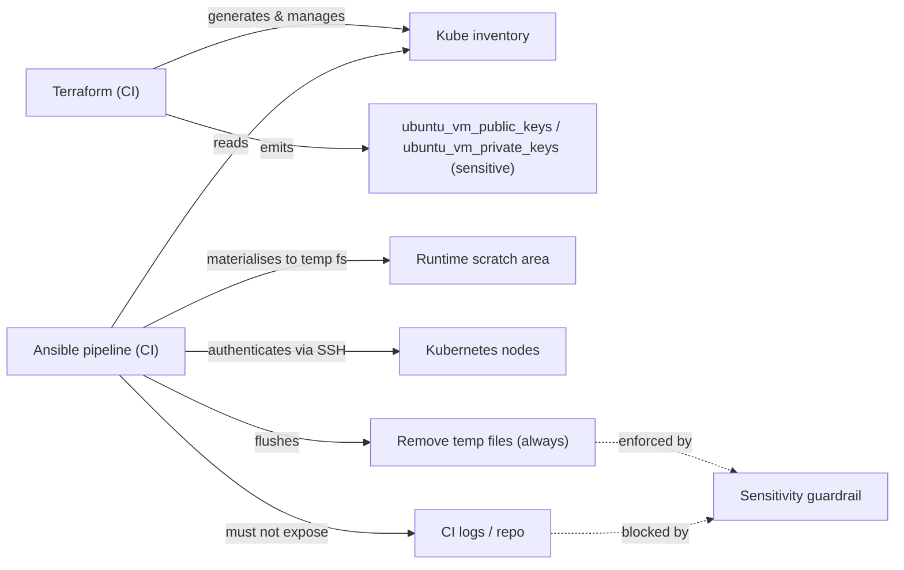
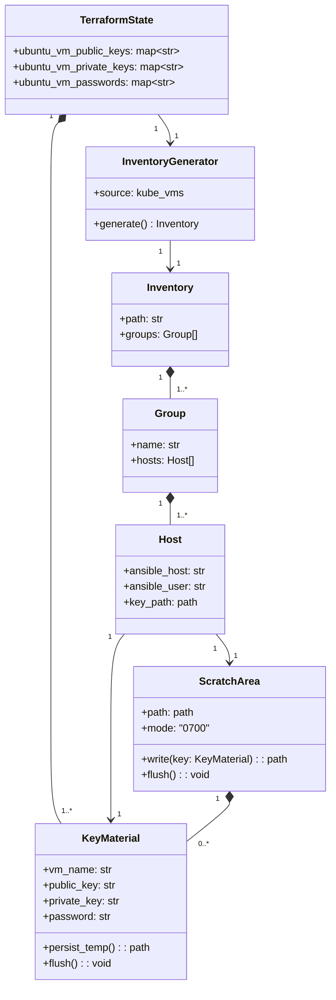
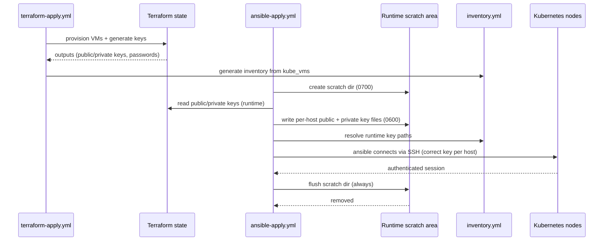
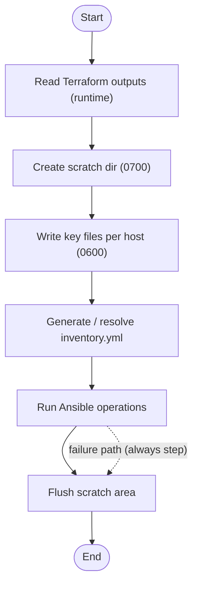
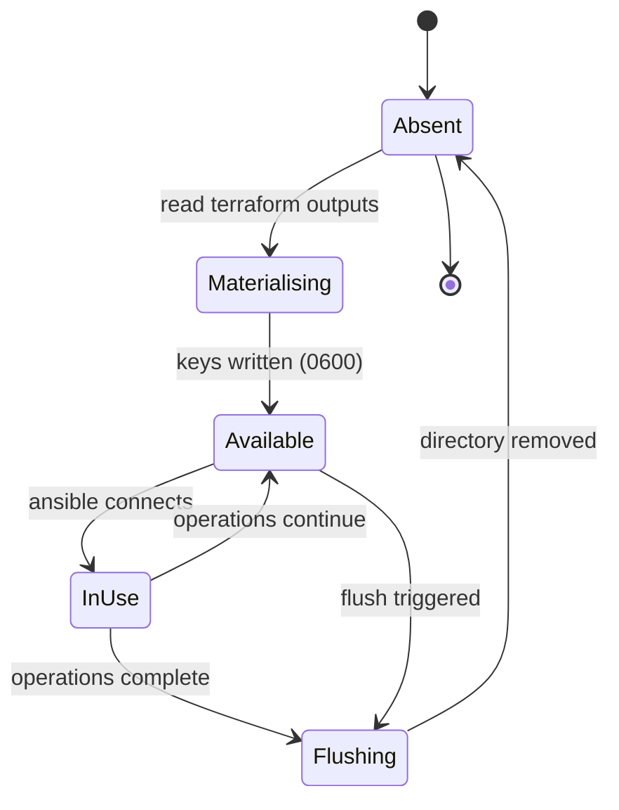
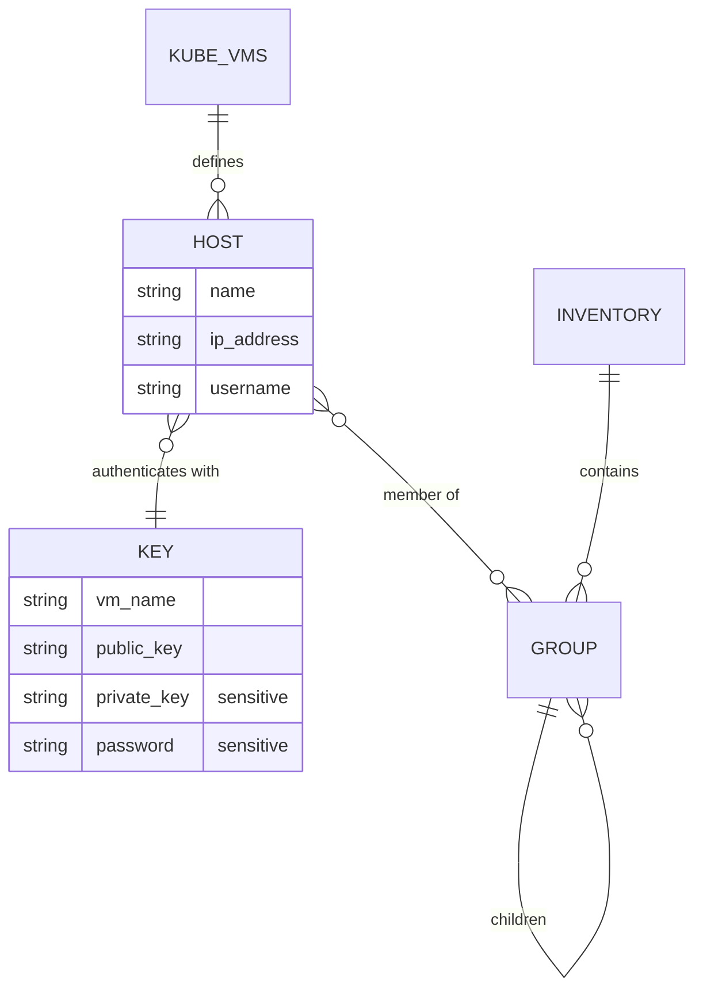
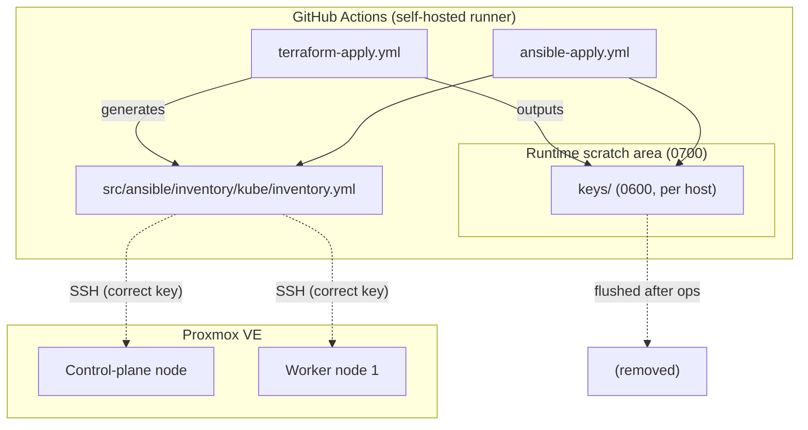

# Kubernetes Cluster Setup — Operational Inventory Requirements (Provisional)

| Field | Value |
| --- | --- |
| Document ID | `HS-ANS-002` |
| Version | 1.1 |
| Status | **Provisional** (draft for review) |
| Date | 2026-08-12 |
| Source | `docs/ansible/00_kube_setup.md` (Operational objectives — Inventory) |
| Related | `HS-ANS-001` — `01_kube_setup_ci_requirements_documentation.md` |

**Change log**

| Version | Change |
| --- | --- |
| 1.1 | Source updated: `ubuntu_vm_private_keys` added as an explicit credential output from Terraform state. Resolves OQ-03 — private keys are now in scope for SSH authentication. |
| 1.0 | Initial provisional requirements. |

---

## Table of Contents

1. [Introduction](#1-introduction)
2. [Objective Analysis](#2-objective-analysis)
3. [Stakeholders](#3-stakeholders)
4. [Definitions and Abbreviations](#4-definitions-and-abbreviations)
5. [Constraints and Assumptions](#5-constraints-and-assumptions)
6. [Functional Requirements](#6-functional-requirements)
7. [Non-Functional Requirements](#7-non-functional-requirements)
8. [Interfaces and Data Flow](#8-interfaces-and-data-flow)
9. [Design Overview](#9-design-overview)
10. [UML Models](#10-uml-models)
11. [Traceability Matrix](#11-traceability-matrix)
12. [Acceptance Criteria](#12-acceptance-criteria)
13. [Out of Scope](#13-out-of-scope)
14. [Open Questions](#14-open-questions)

---

## 1. Introduction

### 1.1 Purpose

This provisional document specifies the **Operational objective — Inventory** of the
Ansible-based Kubernetes cluster setup, as amended in `docs/ansible/00_kube_setup.md`.
It defines how the Ansible inventory is generated and managed by Terraform, how node
authentication is performed, how credentials are handled at runtime, and how
temporary key material is created and flushed.

### 1.2 Status

This document is **provisional**. It records the requirements as currently stated in
the source document and flags ambiguities that must be resolved before implementation
(see [Open Questions](#14-open-questions)).

### 1.3 Scope

In scope:

- Generation and management of the Kubernetes inventory by Terraform.
- SSH/certificate-based authentication between Ansible and the nodes using keys from Terraform state.
- Runtime handling of temporary key material (creation, permissions, flushing).
- Sensitivity constraints on keys and passwords (including CI operations).

Out of scope:

- **Playbooks** — explicitly `DO NOT DO ANYTHING REGARDING PLAYBOOKS`.
- **DevOps objectives** — covered by `HS-ANS-001`.
- **Documentation objectives** — explicitly excluded.

---

## 2. Objective Analysis

### 2.1 Source Objective (Operational — Inventory)

> The hosts specified in the inventory would be generated and managed with Terraform.
> The machine authentication and communication with ansible should be done over the
> openssl certificates. These certificates should be taken from the terraform state outputs.
>
> Following outputs should represent the SSL public keys from terraform state:
> - `ubuntu_vm_public_keys`
> - `ubuntu_vm_private_keys`
>
> The correct keys should be used for authentication, while maintaining the sensitivity
> of the repository. DO NOT EXPOSE any paths to private/public keys or to passwords!
> Also not in the CI operations!
>
> These public keys should be saved in the temporary file system for the ansible execution.
> At the end of ansible operations, these temporary files should be flushed out.

### 2.2 Interpretation

| Statement | Interpretation |
| --- | --- |
| Hosts generated/managed with Terraform | Terraform is the **single source of truth** for node identity; the inventory reflects Terraform state, not hand-maintained data. |
| Authentication over OpenSSL certificates from Terraform outputs | Nodes authenticate Ansible over **SSH using the key material generated by the Terraform `modules/kube` module** (RSA key pair; public key injected into the VM via cloud-init). |
| `ubuntu_vm_public_keys` / `ubuntu_vm_private_keys` represent the SSL public keys | These Terraform outputs (maps of VM name → OpenSSH public key / RSA private key) are the designated credential sources. |
| Correct keys used for authentication | Key selection must be deterministic per host (mapped by the Terraform VM name); the **private key authenticates** the SSH connection, the **public key** identifies/verifies the host pair. |
| Maintain sensitivity of repository | No key content, key paths, or passwords may be committed. |
| DO NOT EXPOSE paths, even in CI | Paths to keys/passwords must not surface in committed files **or CI logs/artifacts**. |
| Keys saved in temporary file system | Key material is materialised at runtime into a scratch location only for the duration of the run. |
| Flush at end of operations | Temporary files are removed when Ansible operations complete, **including on failure**. |

### 2.3 Goal Tree



---

## 3. Stakeholders

| Stakeholder | Interest |
| --- | --- |
| **Operator / Home-lab owner** | Trustworthy, repeatable inventory that always matches provisioned VMs; no credential leakage. |
| **Terraform (CI `terraform-apply.yml`)** | Owns VM lifecycle and emits `ubuntu_vm_public_keys` (and other outputs) consumed downstream. |
| **Ansible pipeline (CI `ansible-apply.yml`)** | Consumes the generated inventory and runtime key material; must not leak secrets. |
| **Kubernetes nodes (Proxmox VMs)** | SSH targets; authenticate the Ansible connection with their injected public keys. |

---

## 4. Definitions and Abbreviations

| Term | Definition |
| --- | --- |
| TLS/SSL certificate | In this context the key material generated by the `modules/kube` Terraform module (`tls_private_key`) and injected as OpenSSH public key. |
| `ubuntu_vm_public_keys` | Sensitive Terraform output: map of VM name → OpenSSH public key. |
| `ubuntu_vm_private_keys` | Sensitive Terraform output: map of VM name → RSA private key (PEM). |
| `ubuntu_vm_passwords` | Sensitive Terraform output: map of VM name → cloud-init user password. |
| Runtime scratch area | Temporary directory used only during an Ansible run to hold key material. |
| Flush | Remove all temporary key files from the scratch area after operations. |

---

## 5. Constraints and Assumptions

### 5.1 Constraints

| ID | Constraint |
| --- | --- |
| C-01 | **Playbooks must not be implemented** (per `00_kube_setup.md`). |
| C-02 | **Documentation objectives must not be implemented** (per `00_kube_setup.md`). |
| C-03 | The inventory is **generated and managed by Terraform** — not manually maintained. |
| C-04 | Key material comes **only from Terraform state outputs**. |
| C-05 | **No paths** to private/public keys or passwords may be exposed — in the repository **or in CI operations**. |
| C-06 | Public keys are materialised in a **temporary file system** for the duration of Ansible execution. |
| C-07 | Temporary files **must be flushed** at the end of Ansible operations (success or failure). |
| C-08 | Both `ubuntu_vm_public_keys` **and** `ubuntu_vm_private_keys` are designated credential outputs from Terraform state. |

### 5.2 Assumptions

| ID | Assumption |
| --- | --- |
| A-01 | Terraform outputs `ubuntu_vm_public_keys`, `ubuntu_vm_private_keys`, `ubuntu_vm_passwords` are available (already defined in `outputs.tf`). |
| A-02 | Host identity (name, IP, SSH user) is derivable from the `kube_vms` Terraform variable. |
| A-03 | The `modules/kube` module injects the generated public key into each VM's `authorized_keys` via cloud-init, enabling SSH key authentication. |
| A-04 | The runtime scratch area lives on the self-hosted runner, shared between the Terraform and Ansible workflows. |
| A-05 | SSH authentication uses the **private key** sourced from `ubuntu_vm_private_keys`; the public key from `ubuntu_vm_public_keys` is used for per-host mapping/verification. Both are materialised in the scratch area. |

---

## 6. Functional Requirements

MoSCoW priorities: **M**ust, **S**hould, **C**ould, **W**on't.

### 6.1 Inventory Generation and Management

| ID | Requirement | Priority |
| --- | --- | --- |
| FR-INV-001 | The Kubernetes inventory must be **generated and managed by Terraform**; Terraform state is the single source of truth for hosts. | M |
| FR-INV-002 | The generated inventory must be written to `src/ansible/inventory/kube/inventory.yml`. | M |
| FR-INV-003 | Hosts must be derived from the `kube_vms` Terraform variable (VM name, `ip_address`, `username`). | M |
| FR-INV-004 | The inventory must be regenerated on every Terraform apply so it always matches the actual provisioned VMs. | M |
| FR-INV-005 | The inventory must group hosts per Kubernetes role (`kube_control_plane`, `kube_worker`) consistent with the DevOps requirements (`HS-ANS-001`). | S |
| FR-INV-006 | The committed/generated inventory must **not** contain key material, passwords, or their paths. | M |

### 6.2 Authentication and Certificates

| ID | Requirement | Priority |
| --- | --- | --- |
| FR-AUTH-001 | Ansible must authenticate to nodes over SSH using key material derived from Terraform state outputs. | M |
| FR-AUTH-002 | Public keys must be sourced from the Terraform output `ubuntu_vm_public_keys`. | M |
| FR-AUTH-003 | The **correct key** must be selected per host — mapped deterministically by the Terraform VM name. | M |
| FR-AUTH-004 | Key material must be consumed at runtime only; nothing is committed to the repository. | M |
| FR-AUTH-005 | Authentication must use the least-privilege SSH user created by cloud-init (`kube_vms.username`). | S |
| FR-AUTH-006 | **Private keys must be sourced from the Terraform output `ubuntu_vm_private_keys`** and referenced per host as `ansible_ssh_private_key_file` for SSH authentication. | M |

### 6.3 Temporary File Handling (Lifecycle)

| ID | Requirement | Priority |
| --- | --- | --- |
| FR-TMP-001 | Public **and private** keys must be materialised into a **temporary/runtime scratch area** before Ansible execution. | M |
| FR-TMP-002 | The scratch directory must be created with owner-only permissions (e.g. `0700`). | M |
| FR-TMP-003 | Key files must be written with owner-only permissions (e.g. `0600`). | M |
| FR-TMP-004 | At the end of Ansible operations the scratch directory and its contents must be **flushed** (removed). | M |
| FR-TMP-005 | Flushing must occur **regardless of success or failure** (i.e. in an `always`/`finally`-style step). | M |
| FR-TMP-006 | No key material may remain in the scratch area after the pipeline finishes. | M |

### 6.4 Sensitivity and Repository Integrity

| ID | Requirement | Priority |
| --- | --- | --- |
| FR-SEC-001 | No paths to private/public keys or passwords may be committed to the repository. | M |
| FR-SEC-002 | No paths to private/public keys or passwords may be **exposed in CI operations** (logs, step summaries, artifacts). | M |
| FR-SEC-003 | Key content and passwords must not be echoed to CI logs (use `no_log` / redaction where applicable). | M |
| FR-SEC-004 | Secret-bearing outputs must remain flagged sensitive in Terraform (already the case for `ubuntu_vm_*`). | M |

---

## 7. Non-Functional Requirements

| ID | Category | Requirement |
| --- | --- | --- |
| NFR-REL-001 | Reliability | Inventory generation and key materialisation must be idempotent and safe to re-run. |
| NFR-SEC-001 | Security | Credentials exist only at runtime and only for the duration of the run (zero persistence). |
| NFR-SEC-002 | Security | No plaintext secret appears in any persisted artifact (repo, state-derived files, logs). |
| NFR-MAINT-001 | Maintainability | Inventory ownership lives in Terraform; Ansible consumes without hand-editing host data. |
| NFR-OBS-001 | Observability | Logs distinguish phases (inventory build → key setup → run → flush) without leaking paths or material. |
| NFR-PORT-001 | Portability | Keys are standard OpenSSH format; inventory compatible with `ansible-inventory` parsing. |

---

## 8. Interfaces and Data Flow

### 8.1 External Interfaces

| Interface | Producer | Consumer | Description |
| --- | --- | --- | --- |
| `ubuntu_vm_public_keys` | `terraform-apply.yml` / `outputs.tf` | Ansible inventory bootstrap | Map of VM name → OpenSSH public key. |
| `ubuntu_vm_private_keys` | `terraform-apply.yml` / `outputs.tf` | Ansible SSH connection | Map of VM name → RSA private key; materialised in scratch and used as `ansible_ssh_private_key_file`. |
| `kube_vms` variable | `terraform.tfvars` | Inventory generator | Host identity: name, IP, username. |
| Runtime scratch area | Ansible pipeline | Nodes | Short-lived key files during the run; flushed afterwards. |

### 8.2 Data Flow



---

## 9. Design Overview

### 9.1 Suggested Runtime Scratch Area

| Path | Purpose | Lifecycle |
| --- | --- | --- |
| `$HOME/ansible-runtime/kube/keys/` | Materialised key files per VM (`<vm-name>.pub` public key, `<vm-name>` private key) | Created at run start, flushed at run end (always). |
| `$HOME/ansible-runtime/kube/inventory.generated.yml` | Runtime-resolved inventory referencing scratch key paths | Regenerated per Terraform apply; not committed. |

> The exact scratch location is provisional; the canonical choice must not appear in
> committed files or CI logs (FR-SEC-001/002).

### 9.2 Generation Ownership

- Terraform (`modules/kube` + top-level `outputs.tf`) owns VM lifecycle and credential outputs.
- A Terraform-managed local render (e.g. `local_file`) or the CI bootstrap step generates `inventory.yml` from `kube_vms` + outputs.
- Ansible consumes the generated inventory; it never edits host data.

---

## 10. UML Models

### 10.1 Use Case Diagram



### 10.2 Class Diagram — Inventory and Credential Domain



### 10.3 Sequence Diagram — Inventory Bootstrap Lifecycle



### 10.4 Activity Diagram — Consume and Flush



### 10.5 State Diagram — Temporary Key Lifecycle



### 10.6 Entity-Relationship Diagram — Inventory Data Model



### 10.7 Component / Deployment Diagram



### 10.8 Requirement Traceability Diagram

```mermaid
requirementDiagram
    requirement OPS_INV {
        id: GOAL-OP
        text: Inventory generated & managed by Terraform with certificate-based auth from state outputs
        risk: medium
        verifymethod: inspection
    }
    requirement FR_INV {
        id: FR-INV
        text: Inventory generated by Terraform at the canonical path without secret material
        risk: medium
        verifymethod: inspection
    }
    requirement FR_AUTH {
        id: FR-AUTH
        text: SSH auth using correct public and private keys from ubuntu_vm_public_keys and ubuntu_vm_private_keys per host
        risk: high
        verifymethod: test
    }
    requirement FR_TMP {
        id: FR-TMP
        text: Keys materialised to temp fs and flushed after operations always
        risk: high
        verifymethod: test
    }
    requirement FR_SEC {
        id: FR-SEC
        text: No key paths or passwords exposed in repo or CI operations
        risk: high
        verifymethod: analysis
    }

    element terraform_state {
        type: configuration
        docref: outputs.tf
    }
    element inventory_file {
        type: configuration
        docref: src/ansible/inventory/kube/inventory.yml
    }
    element runtime_scratch {
        type: infrastructure
        docref: ansible-apply.yml
    }

    OPS_INV - derives -> FR_INV
    OPS_INV - derives -> FR_AUTH
    OPS_INV - derives -> FR_TMP
    OPS_INV - derives -> FR_SEC
    FR_INV - satisfies -> inventory_file
    FR_AUTH - verifies -> terraform_state
    FR_TMP - verifies -> runtime_scratch
    FR_SEC - verifies -> runtime_scratch
```

---

## 11. Traceability Matrix

| Requirement | Source statement (`00_kube_setup.md`) | Verification |
| --- | --- | --- |
| FR-INV-001 … 006 | "hosts … generated and managed with Terraform"; path given | `ansible-inventory --list`; diff against `kube_vms` |
| FR-AUTH-001 … 006 | "authentication … over the openssl certificates … from the terraform state outputs"; outputs list (public + private) | SSH connection test per host using the private key from `ubuntu_vm_private_keys` |
| FR-TMP-001 … 006 | "public keys should be saved in the temporary file system … flushed out" | File-exists check pre-run; absent post-run (success & failure) |
| FR-SEC-001 … 004 | "DO NOT EXPOSE any paths … Also not in the CI operations!" | Secret scan, CI log audit |
| NFR-* | Cross-cutting | Run observations |

---

## 12. Acceptance Criteria

| # | Criterion |
| --- | --- |
| AC-01 | `src/ansible/inventory/kube/inventory.yml` reflects the hosts defined in `kube_vms` and is regenerated by Terraform. |
| AC-02 | Ansible connects to each node over SSH using the per-host private key from `ubuntu_vm_private_keys`; the paired public key from `ubuntu_vm_public_keys` is used for mapping/verification. |
| AC-03 | Key material exists in the runtime scratch area during the run only. |
| AC-04 | After a successful run, the scratch area contains no key files. |
| AC-05 | After a **failed** run, the scratch area also contains no key files (flush in `always`). |
| AC-06 | No key path, key content, or password appears in the repository or in CI logs/artifacts. |
| AC-07 | The inventory and key files carry restrictive permissions (`0700` dir, `0600` files). |

---

## 13. Out of Scope

Per `00_kube_setup.md`:

- **Playbooks** — `DO NOT DO ANYTHING REGARDING PLAYBOOKS`.
- **Documentation objectives** — not to be implemented.
- **DevOps objectives** — covered separately by `HS-ANS-001` (`01_kube_setup_ci_requirements_documentation.md`).

---

## 14. Open Questions

> **Resolved:** OQ-03 — the source document now lists `ubuntu_vm_private_keys` as a
> credential output alongside `ubuntu_vm_public_keys`. Private keys are in scope for
> SSH authentication (see FR-AUTH-006) and are materialised in the scratch area.

| # | Question | Impact |
| --- | --- | --- |
| OQ-01 | Where exactly should the temporary file system live, and how is it provisioned/cleaned between Terraform and Ansible workflows? | FR-TMP-001/004 design |
| OQ-02 | Should `inventory.yml` be rendered by Terraform (`local_file`) or generated by the CI bootstrap step from `terraform output`? | FR-INV-001/004 |
| OQ-04 | Is "openssl certificates" synonymous with the SSH key pair generated by `modules/kube` (`tls_private_key`), or is a separate certificate (x.509) intended? | FR-AUTH-001/002 |
| OQ-05 | Should the scratch key files also be consumed by the CI pipeline (per `HS-ANS-001`) without leaking their paths into CI logs, given the "not in CI operations" constraint? | FR-SEC-002 |
| OQ-06 | How is the control-plane vs worker role determined for inventory grouping (VM name, tag, or IP)? | FR-INV-005 |
