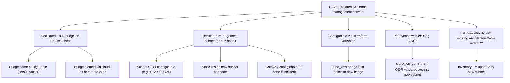
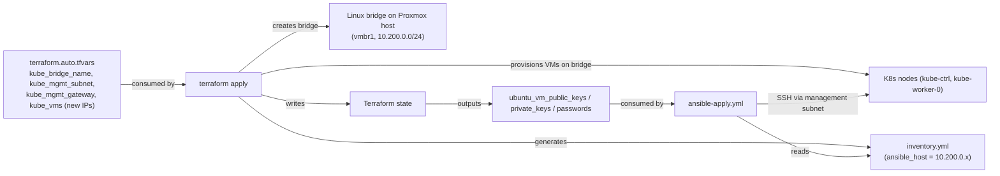
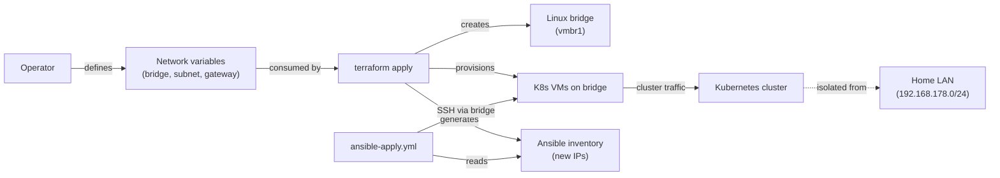
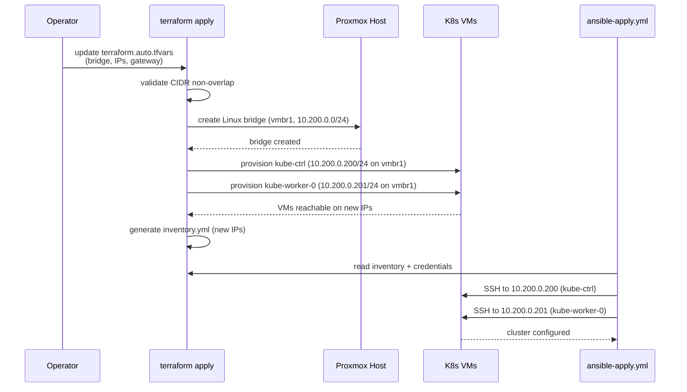
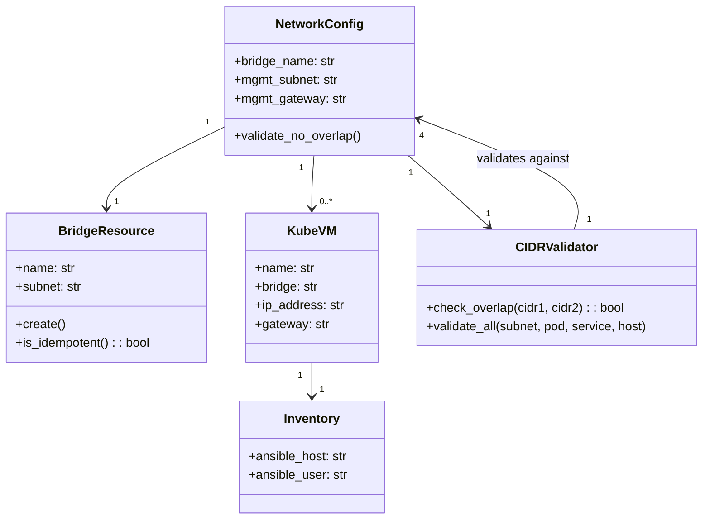
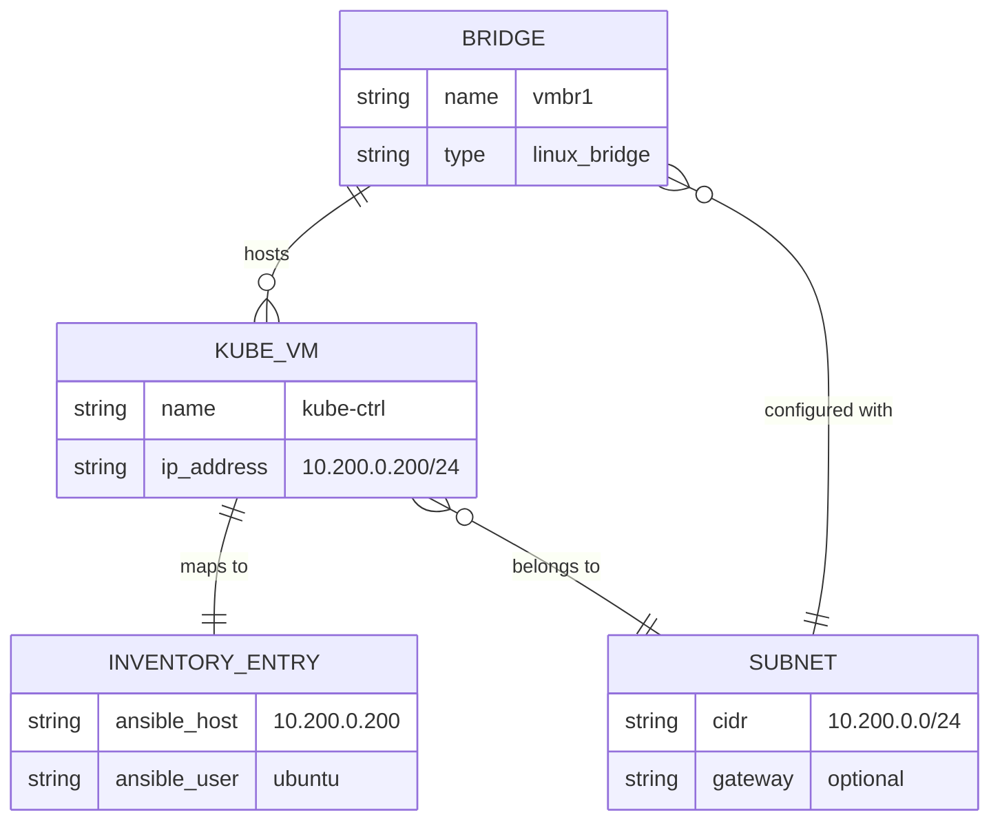

# Kubernetes Cluster Setup — Dedicated Virtual Network Bridge Requirements

| Field | Value |
| --- | --- |
| Document ID | `HS-ANS-003` |
| Version | 1.0 |
| Status | **Draft** |
| Date | 2026-08-16 |
| Source | `docs/ansible/00_kube_setup.md` (Operational objectives — networking) |
| Related | `HS-ANS-001` — `01_kube_setup_ci_requirements_documentation.md` |
| Related | `HS-ANS-002` — `02_kube_setup_ops_inventory_requirements.md` |

---

## Table of Contents

1. [Introduction](#1-introduction)
2. [Objective Analysis](#2-objective-analysis)
3. [Stakeholders](#3-stakeholders)
4. [Definitions and Abbreviations](#4-definitions-and-abbreviations)
5. [Constraints and Assumptions](#5-constraints-and-assumptions)
6. [Network Topology](#6-network-topology)
7. [Functional Requirements](#7-functional-requirements)
8. [Non-Functional Requirements](#8-non-functional-requirements)
9. [Interfaces and Data Flow](#9-interfaces-and-data-flow)
10. [Design Overview](#10-design-overview)
11. [UML Models](#11-uml-models)
12. [Traceability Matrix](#12-traceability-matrix)
13. [Acceptance Criteria](#13-acceptance-criteria)
14. [Out of Scope](#14-out-of-scope)
15. [Open Questions](#15-open-questions)

---

## 1. Introduction

### 1.1 Purpose

This document specifies the requirements for introducing a **dedicated Linux bridge** on the
Proxmox host that is exclusively used by Kubernetes cluster nodes (control plane and workers).
The bridge isolates Kubernetes node management traffic from the broader home network, providing
a clean network boundary for the cluster and simplifying future network policy, firewall, and
debugging operations.

### 1.2 Background

Currently both the control plane VM (`kube-ctrl` at `192.168.178.200`) and the worker VM
(`kube-worker-0` at `192.168.178.201`) sit on the default `vmbr0` bridge, which is the same
bridge used by all other Proxmox hosts and devices on the `192.168.178.0/24` subnet. This
shared-bridge topology creates several problems:

- Kubernetes node management traffic is broadcast onto the home LAN, exposing the cluster
  API server, kubelet, and kube-proxy ports to every device on the subnet.
- There is no network-level boundary between Kubernetes infrastructure and general home
  network traffic, complicating firewall rules and troubleshooting.
- Pod CIDR, Service CIDR, and host CIDR all need careful non-overlapping planning; a
  dedicated management subnet adds a clear fourth CIDR that is easy to reason about.
- The recent Calico CNI misconfiguration (workers never reaching `Ready`) was harder to
  diagnose because node-level network issues blended with home LAN traffic.

### 1.3 Scope

In scope:

- Defining the new dedicated bridge network (subnet, address space, isolation).
- Specifying how the bridge is created on the Proxmox host via Terraform.
- Updating `kube_vms` to use the new bridge and a dedicated subnet.
- Ensuring the Ansible inventory and playbooks remain compatible.
- Ensuring pod and service CIDRs do not overlap with the new management subnet.

Out of scope:

- Changes to the Ansible operational playbooks themselves (node bootstrap, kubeadm init,
  worker join) beyond network-related parameters.
- Changes to the CI pipeline structure (`.github/workflows/`).
- Firewall rules on the Proxmox host for the new bridge (future work).

---

## 2. Objective Analysis

### 2.1 Source Objective

The objective is derived from the operational goal in `docs/ansible/00_kube_setup.md` and
from operational experience: Kubernetes cluster nodes should run on a **dedicated, isolated**
virtual network rather than sharing the default host bridge with all other devices.

### 2.2 Interpretation

| Statement | Interpretation |
| --- | --- |
| Dedicated bridge exclusively for K8s nodes | A Linux bridge (`vmbr1` or configurable name) on the Proxmox host, attached only to the K8s VMs — no other VMs or host interfaces share it. |
| Control plane and workers on the same bridge | Both `kube-ctrl` and `kube-worker-*` connect their primary NIC to the new bridge for cluster-internal communication. |
| Configurable via Terraform | The bridge name, subnet CIDR, gateway, and per-node static IPs are all exposed as Terraform variables — not hardcoded in any `.tf` or `.yml` file. |
| Not overlapping with existing CIDRs | The new management subnet must not overlap with: host network (`192.168.178.0/24`), pod network (`10.168.178.0/24`), or service CIDR (`10.96.0.0/12`). |

### 2.3 Goal Tree



---

## 3. Stakeholders

| Stakeholder | Interest |
| --- | --- |
| **Operator / Home-lab owner** | Clean network isolation; easier troubleshooting; secure cluster boundary. |
| **Terraform workflow** | Bridge creation integrated into the provisioning pipeline; variables for all network parameters. |
| **Ansible workflow** | Inventory reflects the new subnet; playbooks work without modification (or with minimal adjustment). |
| **Kubernetes nodes (VMs)** | Reachable over the new bridge; able to reach the internet for package installation (if outbound is required). |
| **Calico CNI** | Pod network remains separate from the management bridge; no interference with CNI configuration. |
| **Proxmox host** | New bridge resource created; no conflict with `vmbr0` or other bridges. |

---

## 4. Definitions and Abbreviations

| Term | Definition |
| --- | --- |
| Linux bridge | A kernel-level Layer 2 switch implemented in the Linux networking stack; Proxmox uses these for VM networking (e.g. `vmbr0`). |
| `vmbr0` | The default Proxmox Linux bridge, typically attached to the host's primary physical NIC and the home LAN. |
| Management subnet | The dedicated CIDR block used for Kubernetes node-to-node and Ansible-to-node communication. |
| Pod CIDR | The CIDR range from which pod IPs are allocated (`10.168.178.0/24` in this cluster). |
| Service CIDR | The CIDR range from which Kubernetes Service cluster IPs are allocated (`10.96.0.0/12` default). |
| cloud-init | Proxmox's mechanism for initial VM configuration, including network settings injected at first boot. |
| Isolated bridge | A bridge with no uplink to the physical network or the default gateway; VMs on it can only communicate with each other and the Proxmox host. |

---

## 5. Constraints and Assumptions

### 5.1 Constraints

| ID | Constraint |
| --- | --- |
| C-01 | The bridge must be a **Linux bridge** created on the Proxmox host, not an Open vSwitch or other virtual switch. |
| C-02 | All network parameters (bridge name, subnet, gateway, per-node IPs) must be **configurable via Terraform variables** — no hardcoded values. |
| C-03 | The new management subnet must **not overlap** with `192.168.178.0/24` (host), `10.168.178.0/24` (pod), or `10.96.0.0/12` (service). |
| C-04 | The `modules/kube` Terraform module already supports a `bridge` parameter on the VM NIC — the new bridge must be usable by passing its name to this parameter. |
| C-05 | The Proxmox provider (`bpg/proxmox ~> 0.111.1`) does not have a dedicated bridge resource; the bridge must be created via cloud-init or remote-exec. |
| C-06 | The existing Ansible inventory (`src/ansible/inventory/kube/inventory.yml`) must be updated to reflect the new management IPs. |
| C-07 | `kubeadm init` is invoked with `--pod-network-cidr={{ k8s_pod_network_cidr }}` — this CIDR must remain separate from the management subnet. |
| C-08 | The worker join command uses `hostvars['kube-ctrl']['ansible_default_ipv4']['address']` — this must resolve to the new management IP after migration. |

### 5.2 Assumptions

| ID | Assumption |
| --- | --- |
| A-01 | The Proxmox host has sufficient physical NICs or VLAN capacity to support an additional bridge without affecting `vmbr0` connectivity. |
| A-02 | The new bridge is intended to be **isolated** (no default gateway to the home LAN); K8s nodes reach the internet for package installs via a secondary NIC on `vmbr0` or via NAT, or this requirement is deferred. |
| A-03 | The Terraform `kube_vms` variable already contains per-node `bridge`, `ip_address`, and `gateway` fields — the new bridge name is passed via these existing fields. |
| A-04 | The Proxmox host OS (Debian-based) supports the `ip link` and `brctl` commands for bridge creation via cloud-init or remote-exec. |
| A-05 | Outbound internet access for the K8s nodes (for `apt update`, `kubeadm init` image pulls, etc.) is either provided by a secondary interface or is acceptable to be addressed in a follow-up requirement. |

---

## 6. Network Topology

### 6.1 Current Topology (Before)

```
┌─────────────────────────────────────────────────────┐
│                  Proxmox Host                        │
│                                                      │
│  vmbr0 (192.168.178.0/24)                           │
│  ├── eth0 (uplink to home LAN)                      │
│  ├── kube-ctrl         192.168.178.200              │
│  ├── kube-worker-0     192.168.178.201              │
│  └── [other VMs / host]                             │
│                                                      │
│  No dedicated K8s bridge                             │
└─────────────────────────────────────────────────────┘
```

### 6.2 Target Topology (After)

```
┌─────────────────────────────────────────────────────┐
│                  Proxmox Host                        │
│                                                      │
│  vmbr0 (192.168.178.0/24) — existing, unchanged     │
│  ├── eth0 (uplink to home LAN)                      │
│  └── [other VMs / host]                             │
│                                                      │
│  vmbr1 (10.200.0.0/24) — NEW dedicated K8s bridge   │
│  ├── kube-ctrl         10.200.0.200                 │
│  └── kube-worker-0     10.200.0.201                 │
│                                                      │
└─────────────────────────────────────────────────────┘
```

### 6.3 Address Space Allocation

| CIDR | Purpose | Notes |
| --- | --- | --- |
| `192.168.178.0/24` | Home LAN / host network (`vmbr0`) | Existing; not changed. |
| `10.200.0.0/24` | **K8s node management** (`vmbr1`) | **NEW**; dedicated bridge. Configurable via variables. |
| `10.168.178.0/24` | Pod network (Calico CNI) | Existing; must not overlap with management subnet. |
| `10.96.0.0/12` | Service CIDR (kubeadm default) | Existing; must not overlap with management subnet. |

> **Overlap validation:** `10.200.0.0/24` does not overlap with `10.168.178.0/24` (pod) or
> `10.96.0.0/12` (service, which covers `10.96.0.0 – 10.111.255.255`). The management
> subnet `10.200.0.0/24` is entirely outside the service CIDR range.

---

## 7. Functional Requirements

MoSCoW priorities: **M**ust, **S**hould, **C**ould, **W**on't.

### 7.1 Bridge Definition (Terraform Variables)

| ID | Requirement | Priority |
| --- | --- | --- |
| FR-BRIDGE-001 | A new Terraform variable `kube_bridge_name` must be defined (type `string`, default `"vmbr1"`) to specify the name of the dedicated K8s bridge on the Proxmox host. | M |
| FR-BRIDGE-002 | A new Terraform variable `kube_mgmt_subnet` must be defined (type `string`, default `"10.200.0.0/24"`) to specify the management subnet CIDR. | M |
| FR-BRIDGE-003 | A new Terraform variable `kube_mgmt_gateway` must be defined (type `string`, default `null`) to optionally specify a gateway for the management subnet. A `null` value means the bridge is isolated (no gateway). | M |
| FR-BRIDGE-004 | Per-node static IPs on the management subnet must be derived from the existing `kube_vms` variable `ip_address` field, which will be updated to reference the new subnet (e.g. `10.200.0.200/24`). | M |
| FR-BRIDGE-005 | All new variables must appear in `variables.tf` and be documented with descriptions and sensible defaults. | M |
| FR-BRIDGE-006 | A validation block must be added to `kube_mgmt_subnet` to ensure it is a valid CIDR and does not overlap with `192.168.178.0/24` (host), `10.168.178.0/24` (pod), or `10.96.0.0/12` (service). | S |

### 7.2 Bridge Creation (Proxmox Host)

| ID | Requirement | Priority |
| --- | --- | --- |
| FR-CREATE-001 | The dedicated Linux bridge must be created on the Proxmox host **before** any K8s VM is provisioned. | M |
| FR-CREATE-002 | The bridge creation must be implemented as a Terraform `proxmox_virtual_environment_file` (cloud-init snippet) or `null_resource` with `remote-exec` provisioner — whichever the Proxmox provider supports for host-level operations. | M |
| FR-CREATE-003 | The bridge creation must be **idempotent**: re-running `terraform apply` must not fail if the bridge already exists. | M |
| FR-CREATE-004 | The bridge creation resource must reference `var.kube_bridge_name` for the bridge name and `var.kube_mgmt_subnet` for the CIDR. | M |
| FR-CREATE-005 | The bridge should persist across Proxmox host reboots (achieved by writing to `/etc/network/interfaces.d/` or equivalent). | S |

### 7.3 VM Network Configuration

| ID | Requirement | Priority |
| --- | --- | --- |
| FR-VM-001 | Each K8s VM's `network_device` block must reference the new bridge via the `bridge` parameter (passed through `kube_vms` → `modules/kube` → `network_device.bridge`). | M |
| FR-VM-002 | Each K8s VM's `ip_config.ipv4.address` must be set to a static IP within `var.kube_mgmt_subnet` (e.g. `10.200.0.200/24`). | M |
| FR-VM-003 | Each K8s VM's `ip_config.ipv4.gateway` must be set to `var.kube_mgmt_gateway` if non-null, or omitted if `null`. | M |
| FR-VM-004 | The `bridge` field in `kube_vms` must default to `var.kube_bridge_name` at the top-level module, so individual VMs inherit the bridge unless overridden. | S |

### 7.4 CIDR Non-Overlap Validation

| ID | Requirement | Priority |
| --- | --- | --- |
| FR-CIDR-001 | The management subnet (`kube_mgmt_subnet`) must be validated at `terraform plan` time to ensure it does not overlap with `192.168.178.0/24`. | M |
| FR-CIDR-002 | The management subnet must be validated to not overlap with the pod network CIDR (`10.168.178.0/24`). | M |
| FR-CIDR-003 | The management subnet must be validated to not overlap with the service CIDR (`10.96.0.0/12`). | M |
| FR-CIDR-004 | Validation must produce a clear error message identifying which CIDR conflicts if an overlap is detected. | S |

### 7.5 Ansible Inventory and Playbook Compatibility

| ID | Requirement | Priority |
| --- | --- | --- |
| FR-ANS-001 | The Ansible inventory (`src/ansible/inventory/kube/inventory.yml`) `ansible_host` values must reflect the new management subnet IPs (e.g. `10.200.0.200`, `10.200.0.201`). | M |
| FR-ANS-002 | The worker join command (`kubeadm join {{ hostvars['kube-ctrl']['ansible_default_ipv4']['address'] }}:6443`) must resolve to the new management IP — no change needed if Ansible auto-detects the correct default interface. | M |
| FR-ANS-003 | The `k8s_pod_network_cidr` (`10.168.178.0/24`) and Service CIDR (`10.96.0.0/12`) must remain unchanged and not conflict with the new management subnet. | M |
| FR-ANS-004 | If outbound internet access is required from the K8s nodes (for package installation), the solution must either (a) add a secondary NIC on `vmbr0` or (b) configure NAT on the Proxmox host. The chosen approach must be documented. | S |

---

## 8. Non-Functional Requirements

| ID | Category | Requirement |
| --- | --- | --- |
| NFR-REL-001 | Reliability | Bridge creation must be idempotent — re-running `terraform apply` on an existing bridge must not fail or recreate the bridge. |
| NFR-REL-002 | Reliability | The bridge must survive Proxmox host reboots (persistent configuration in `/etc/network/interfaces.d/`). |
| NFR-SEC-001 | Security | K8s node management traffic (API server, kubelet, kube-proxy) is not visible on the home LAN (`192.168.178.0/24`). |
| NFR-SEC-002 | Security | The management bridge should be isolated (no default gateway) unless explicitly configured with one — preventing K8s nodes from being routable from the home LAN without operator intent. |
| NFR-PERF-001 | Performance | Bridge creation adds negligible time to `terraform apply` (< 5 seconds). |
| NFR-MAINT-001 | Maintainability | All network parameters are single-sourced from Terraform variables; no hardcoded IPs or bridge names appear in `.tf` files, `.yml` files, or playbooks. |
| NFR-MAINT-002 | Maintainability | The `kube_vms` variable structure remains unchanged; only the values in `terraform.auto.tfvars` are updated to reference the new bridge and subnet. |
| NFR-OBS-001 | Observability | `terraform plan` output must show the bridge creation and VM network reconfiguration clearly, with no ambiguity about which bridge is being used. |

---

## 9. Interfaces and Data Flow

### 9.1 External Interfaces

| Interface | Producer | Consumer | Description |
| --- | --- | --- | --- |
| `kube_bridge_name` variable | Operator (`terraform.auto.tfvars`) | Terraform bridge creation resource | Name of the Linux bridge on the Proxmox host. |
| `kube_mgmt_subnet` variable | Operator (`terraform.auto.tfvars`) | Terraform bridge creation + VM `ip_config` | CIDR for the management subnet. |
| `kube_mgmt_gateway` variable | Operator (`terraform.auto.tfvars`) | VM `ip_config.ipv4.gateway` | Optional gateway for the management subnet. |
| `kube_vms.bridge` field | Operator (`terraform.auto.tfvars`) | `modules/kube` → `network_device.bridge` | Per-VM bridge assignment (now pointing to the new bridge). |
| `kube_vms.ip_address` field | Operator (`terraform.auto.tfvars`) | `modules/kube` → `ip_config.ipv4.address` | Per-VM static IP (now on the new subnet). |
| Bridge creation resource | Terraform | Proxmox host | Creates the Linux bridge before VMs are provisioned. |
| Ansible inventory | Terraform outputs | Ansible pipeline | `ansible_host` values updated to new management IPs. |

### 9.2 Data Flow



---

## 10. Design Overview

### 10.1 Affected Terraform Files

| File | Change | Rationale |
| --- | --- | --- |
| `variables.tf` | Add `kube_bridge_name`, `kube_mgmt_subnet`, `kube_mgmt_gateway` variables. Add validation to `kube_mgmt_subnet`. | Centralise all network configuration as Terraform variables (FR-BRIDGE-001/002/003/005/006). |
| `main.tf` | Add a `null_resource` (or equivalent) to create the Linux bridge on the Proxmox host before VMs are provisioned. Use `depends_on` or ordering to ensure bridge exists before `module.kube`. | Create the bridge on the host (FR-CREATE-001/002/003). |
| `modules/kube/variables.tf` | No structural change — the `bridge` variable already exists. Default remains `"vmbr0"` at module level. | The bridge name is passed from the top-level module. |
| `modules/kube/main.tf` | No structural change — `network_device { bridge = var.bridge }` already consumes the bridge variable. | No code change needed in the module. |
| `terraform.auto.tfvars` | Update `kube_vms` entries: set `bridge = kube_bridge_name` (or omit to use default), update `ip_address` to the new subnet (e.g. `10.200.0.200/24`), update `gateway` to the new gateway (or `null`). | Point VMs at the new bridge and subnet (FR-VM-001/002/003). |
| `terraform.tfvars.example` | Update example values to demonstrate the new bridge and subnet. | Documentation alignment. |
| `src/ansible/inventory/kube/inventory.yml` | Update `ansible_host` values to the new management IPs (`10.200.0.200`, `10.200.0.201`). | Reflect the new subnet in the Ansible inventory (FR-ANS-001). |

### 10.2 Bridge Creation Strategy

Since the `bpg/proxmox` Terraform provider does not expose a dedicated bridge resource, the
bridge must be created via one of these approaches:

**Option A — `null_resource` with `remote-exec` (preferred):**

```hcl
resource "null_resource" "kube_bridge" {
  triggers = {
    bridge_name = var.kube_bridge_name
    subnet      = var.kube_mgmt_subnet
  }

  connection {
    type     = "ssh"
    host     = var.proxmox_endpoint  # or resolved host IP
    user     = var.proxmox_ssh_username
    private_key = var.proxmox_ssh_private_key
  }

  provisioner "remote-exec" {
    inline = [
      "ip link add name ${var.kube_bridge_name} type bridge",
      "ip addr add ${var.kube_mgmt_subnet} dev ${var.kube_bridge_name} nodad",
      "ip link set ${var.kube_bridge_name} up",
      # Persist across reboots:
      "mkdir -p /etc/network/interfaces.d",
      "cat > /etc/network/interfaces.d/${var.kube_bridge_name} <<EOF",
      "auto ${var.kube_bridge_name}",
      "iface ${var.kube_bridge_name} inet static",
      "    address ${var.kube_mgmt_subnet}",
      "    bridge-ports none",
      "    bridge-stp off",
      "    bridge-fd 0",
      "EOF",
    ]
  }
}
```

**Option B — `proxmox_virtual_environment_file` (cloud-init snippet on host):**
Less suitable for host-level network changes; cloud-init snippets are typically for VM
configuration, not host configuration.

**Decision required:** Option A is recommended. The operator should confirm that SSH access
to the Proxmox host is available for `remote-exec`.

### 10.3 VM `kube_vms` Changes (terraform.auto.tfvars)

```hcl
kube_vms = {
  kube-ctrl = {
    name           = "kube-ctrl"
    description    = "Kubernetes control plane managed by Terraform"
    resource_count = 1
    template_vm_id = 900
    vm_id          = 1001
    cores          = 3
    memory         = 5192
    disk_size      = 32
    bridge         = "vmbr1"              # CHANGED: was "vmbr0" (implicit default)
    ip_address     = "10.200.0.200/24"    # CHANGED: was 192.168.178.200/24
    gateway        = null                 # CHANGED: isolated bridge, no gateway
    username       = "ubuntu"
    tags           = ["k8s", "terraform"]
    hostname       = "machine"
  }

  kube-worker-0 = {
    name           = "kube-worker-0"
    description    = "Kubernetes worker node 0 managed by Terraform"
    resource_count = 1
    template_vm_id = 900
    vm_id          = 1002
    cores          = 3
    memory         = 5192
    disk_size      = 32
    bridge         = "vmbr1"              # CHANGED: was "vmbr0" (implicit default)
    ip_address     = "10.200.0.201/24"    # CHANGED: was 192.168.178.201/24
    gateway        = null                 # CHANGED: isolated bridge, no gateway
    username       = "ubuntu"
    tags           = ["k8s", "terraform"]
    hostname       = "machine"
  }
}
```

### 10.4 Directory Layout (Changes Highlighted)

```
HomeServer.Infrastructure/
├── variables.tf                          # + kube_bridge_name, kube_mgmt_subnet, kube_mgmt_gateway
├── main.tf                               # + null_resource.kube_bridge (bridge creation)
├── terraform.auto.tfvars                 # ~ updated kube_vms (bridge, ip_address, gateway)
├── terraform.tfvars.example              # ~ updated example values
├── modules/kube/
│   ├── main.tf                           #   (no change — already uses var.bridge)
│   ├── variables.tf                      #   (no change — bridge var already exists)
│   └── outputs.tf                        #   (no change)
└── src/ansible/
    └── inventory/kube/
        └── inventory.yml                 # ~ ansible_host updated to new IPs
```

---

## 11. UML Models

### 11.1 Use Case Diagram



### 11.2 Sequence Diagram — Bridge Provisioning and VM Deployment



### 11.3 Class Diagram — Network Configuration Domain



### 11.4 Entity-Relationship Diagram — Network Data Model



---

## 12. Traceability Matrix

| Requirement | Source objective | Verification |
| --- | --- | --- |
| FR-BRIDGE-001 … 006 | Dedicated bridge for K8s; configurable via Terraform | `terraform validate`; variable inspection |
| FR-CREATE-001 … 005 | Bridge created on Proxmox host before VMs | `ip link show vmbr1` on Proxmox host after apply |
| FR-VM-001 … 004 | VMs on new bridge with new subnet IPs | `qm config <vmid>` on Proxmox; verify NIC bridge + IP |
| FR-CIDR-001 … 004 | No overlap with existing CIDRs | `terraform plan` with conflicting CIDR → expect error |
| FR-ANS-001 … 004 | Ansible inventory and playbooks compatible | `ansible-inventory --list`; SSH connectivity test on new IPs |
| NFR-* | Cross-cutting quality | Manual verification, reboot test, security review |

---

## 13. Acceptance Criteria

| # | Criterion |
| --- | --- |
| AC-01 | Running `terraform apply` creates a Linux bridge named `vmbr1` (or configured name) on the Proxmox host with the configured subnet (e.g. `10.200.0.0/24`). |
| AC-02 | Running `terraform apply` a second time is idempotent — the bridge is not recreated and the apply succeeds. |
| AC-03 | Both `kube-ctrl` and `kube-worker-0` VMs are provisioned with their NIC attached to the new bridge and static IPs on the management subnet (`10.200.0.200/24`, `10.200.0.201/24`). |
| AC-04 | `terraform plan` rejects a `kube_mgmt_subnet` that overlaps with `192.168.178.0/24`, `10.168.178.0/24`, or `10.96.0.0/12`, producing a clear error message. |
| AC-05 | `src/ansible/inventory/kube/inventory.yml` reflects `ansible_host: 10.200.0.200` for `kube-ctrl` and `ansible_host: 10.200.0.201` for `kube-worker-0`. |
| AC-06 | Ansible can SSH to both nodes on the new management IPs and execute `ansible all -m ping` successfully. |
| AC-07 | K8s nodes can reach each other over the management bridge (e.g. `ping 10.200.0.201` from `kube-ctrl`). |
| AC-08 | The default `vmbr0` bridge remains unchanged and unaffected on the Proxmox host. |
| AC-09 | After Proxmox host reboot, the new bridge (`vmbr1`) persists and is automatically brought up. |
| AC-10 | `kubeadm init --pod-network-cidr=10.168.178.0/24` succeeds on `kube-ctrl`, and `kube-worker-0` joins successfully via the management bridge IP. |

---

## 14. Out of Scope

- **Firewall rules** on the Proxmox host for the new bridge (e.g. `iptables` / `nftables` rules to control traffic between `vmbr1` and `vmbr0`). This is a follow-up requirement.
- **Outbound internet access** for K8s nodes on the isolated bridge. If the bridge is truly isolated, a secondary NIC on `vmbr0` or NAT masquerade is needed — this is deferred unless the operator decides to add a gateway.
- **Ansible playbook changes** beyond updating the inventory IPs. The operational playbooks (`k8s_control_plane`, `k8s_worker_node`) should work without modification.
- **Calico CNI changes**. The pod network CIDR (`10.168.178.0/24`) is independent of the management bridge and remains unchanged.
- **Multi-node Proxmox clusters**. This requirement assumes a single Proxmox host.

---

## 15. Open Questions

| # | Question | Impact |
| --- | --- | --- |
| OQ-01 | Should the management bridge be **isolated** (no gateway, no internet) or should a gateway be configured to allow K8s nodes to reach the internet for package installation? If isolated, how will nodes reach the internet (secondary NIC on `vmbr0`, or NAT)? | FR-VM-003, FR-ANS-004, AC-10 |
| OQ-02 | Should bridge creation use `null_resource` with `remote-exec` (requires SSH to Proxmox host) or a different mechanism? Is SSH access to the Proxmox host available from the Terraform runner? | FR-CREATE-002 |
| OQ-03 | Should the bridge creation be a separate Terraform root module or remain in the existing `main.tf`? A separate module would allow independent lifecycle management. | FR-CREATE-001, maintainability |
| OQ-04 | What is the desired default for `kube_mgmt_gateway`? `null` (isolated), or the Proxmox host's IP on the bridge (e.g. `10.200.0.1`) for routing? | FR-BRIDGE-003 |
| OQ-05 | Should the `bridge` field in `kube_vms` be replaced with a top-level default (using `var.kube_bridge_name`) so individual VM entries don't need to specify it? This would reduce duplication but change the variable contract. | FR-VM-004, `variables.tf` design |
| OQ-06 | Is the Ansible inventory committed to the repository or generated at runtime? The current file at `src/ansible/inventory/kube/inventory.yml` appears committed with hardcoded IPs — should it be regenerated from Terraform outputs instead? (Related: OQ-02 in HS-ANS-002.) | FR-ANS-001 |
